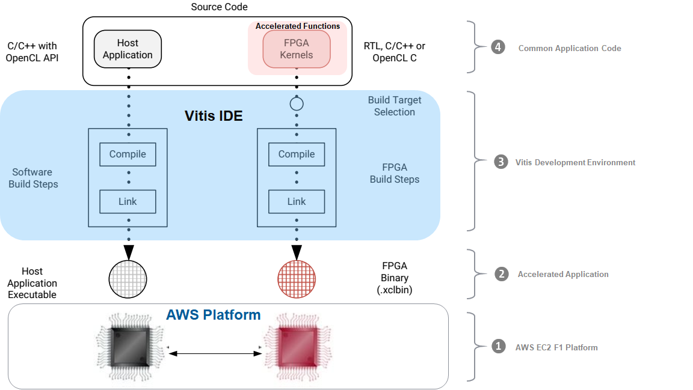

## Lab 1: Vitis Acceleration Environment
This lab demonstrates how to setup Vitis environment and run a simple Hello World application on AWS F1 instance. It also gives overview of **Vitis Acceleration environment**. 

#### Overview of the AWS F1 Platform and Vitis Flow

The architecture of the AWS F1 platform and the Vitis development flow are presented in a figure below:



1. **Amazon EC2 F1** is a compute instance combining x86 CPUs with Xilinx FPGAs. The FPGAs are programmed with custom hardware accelerators which can accelerate complex workloads up to 30x when compared with servers that use CPUs alone.
2. An **F1 application** consists of an x86 executable for the host application and an FPGA binary (also referred to as Amazon FPGA Image or AFI) for the custom hardware accelerators. Communication between the host application and the accelerators is automatically managed by the OpenCL runtime.
3. **Vitis** is the development environment used to create F1 applications. It comes with a full fledged IDE, x86 and FPGA compilers, profiling and debugging tools.
4. The **host application** is written in C or C++ and uses the OpenCL APIs to interact with the accelerated functions. The accelerated functions (also referred to as kernels) can be written in C, C++, OpenCL or even RTL. These compiled kernels can be packaged into FPGA images or FPGA binaries here called AFIs.

#### Running the "Hello World" Example

The "Hello World" example is an OpenCL application with a simple vector addition accelerator. It uses a precompiled FPGA binary to reduce compilation time and streamline the lab. To run this application proceed as follows:

1. Open a new terminal by right-clicking anywhere in the desktop area and by selecting **Open Terminal**.

1.  Source the Vitis environment  

    ```bash
    source $AWS_FPGA_REPO_DIR/vitis_setup.sh
    ```
	*Note: the vitis_setup.sh script might generate warning messages, which can be safely ignored.*

1.  Compile the host application

    ```bash
    # Go to the lab directory
    export LAB_WORK_DIR=/home/centos/src/project_data/
    cd $LAB_WORK_DIR/Vitis-AWS-F1-Developer-Labs/modules/module_01/helloworld

    # Compile the host application (./helloworld)
    make compile_host
    ```

1. Confirm the presence of the precompiled FPGA binary.

    ```bash
    ls -la ./xclbin/vector_addition_hw.awsxclbin
    ```

1. Execute the host application with the precompiled FPGA binary on the F1 instance.

    ```bash
    source $AWS_FPGA_REPO_DIR/vitis_runtime_setup.sh 
	make run TARGET=hw
	```

1. The host application executes using the vector_addition kernel running in the FPGA and produces the following results:

	```
	Platform Name: Xilinx
	Found Device=xilinx_aws-vu9p-f1-04261818_dynamic_5_0
	INFO: Reading ../xclbin/vector_addition_hw.awsxclbin
	Loading: '../xclbin/vector_addition_hw.awsxclbin'
	This AFI already loaded. Skip reload!
	Successfully skipped reloading of local image.
	AFI load complete.
	Result = 
	Hello World !!! 
	Hello World !!! 
	Hello World !!! 
	Hello World !!! 
	Hello World !!! 
	Hello World !!! 
	Hello World !!! 
	Hello World !!! 
	Hello World !!! 
	Hello World !!! 
	Hello World !!! 
	Hello World !!! 
	Hello World !!! 
	Hello World !!! 
	Hello World !!! 
	Hello World !!! 
	TEST PASSED
	```

1. You compiled a host application and successfully executed it on F1 using a pre-compiled Amazon FPGA Image (AFI).

1. Close your terminal.

    ```bash
    exit
    
    ```

This concludes this first lab.

### Summary 
In this lab you learned about:
* Vitis software acceleration development environment 
* How to launch a simple Hello World application 

---------------------------------------

<p align="center"><b>
Start the next lab: <a href="lab_02_idct_introduction.md">Becoming Familiar With IDCT Application</a>
</b></p>
