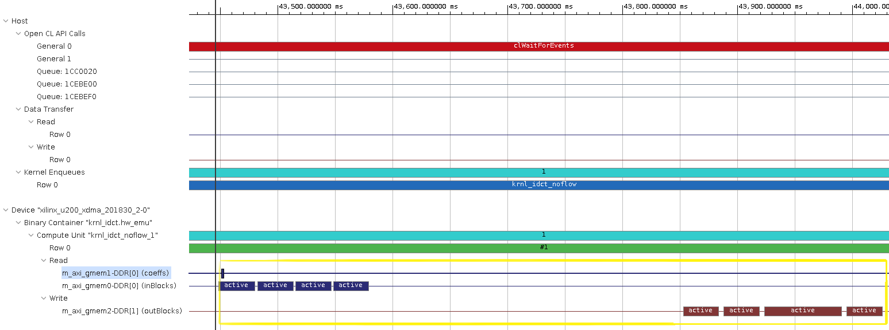
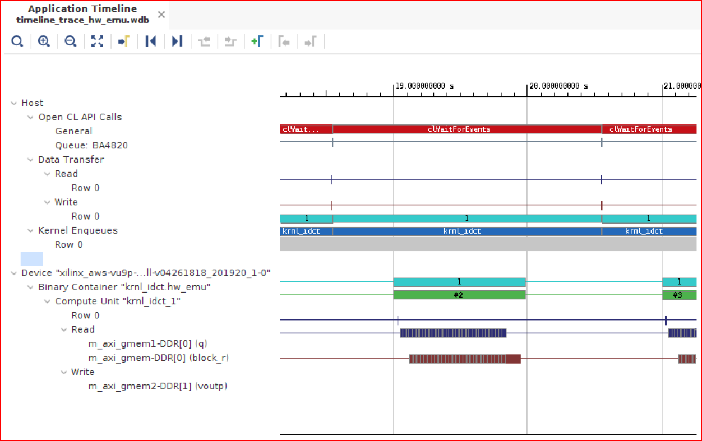
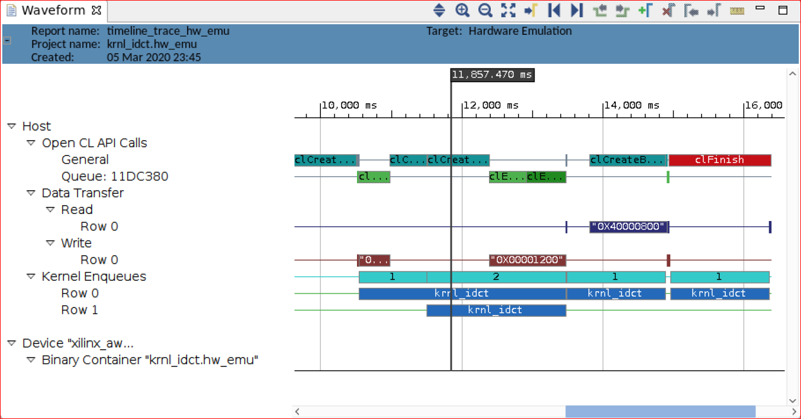

## IDCT Kernel Hardware Optimizations and Performance Analysis

This lab builds on top of previous labs which gave an overview of the Vitis development environment and explained the various performance analysis capabilities provided by the tool. In this lab you will utilize these analysis capabilities to drive and measure code optimizations. This lab illustrates the DATAFLOW optimization and loop pipelining variations and their effect on overall performance. 

Please note that although the entire lab is performed on an F1 instance, only the steps that involve hardware runs need to be to be run on F1 instance. All the interactive development, profiling and optimization steps would normally be performed on-premise or on a cost-effective AWS EC2 instance such as C4. However, to avoid switching from C4 to F1 instances during this lab, all the steps are performed on the F1 instance.

If you have closed the terminal window at the end of the previous lab, open a new one, run setup script and go back to the project folder:
1.  Source the Vitis environment  

    ```bash
    cd $AWS_FPGA_REPO_DIR/
    source vitis_setup.sh
    ```
1. Go to project folder
    
    ```bash 
    export LAB_WORK_DIR=/home/centos/src/project_data/
    cd $LAB_WORK_DIR/Vitis-AWS-F1-Developer-Labs/modules/module_01/idct
    ```
   
### Optimizing the IDCT kernel using Dataflow
We will carry out a simple experiment that illustrates the effect and power of dataflow optimization. The FPGA binary that will be built for experiment is built to have 4 different kernel, there are minor difference between them and they are created to illustrate different performance optimizations. In this experiment we will focus on two kernels namely **krnl_idct** and **krnl_idct_noflow** and compare them. 

1. Open kernel source files and compare

    ```bash
    cd $LAB_WORK_DIR/Vitis-AWS-F1-Developer-Labs/modules/module_01/idct/src 
   open krnl_idct.cpp
   open krnl_idct_noflow.cpp
    ``` 
   
   these files contain description for both of these kernels, they are exactly identical kernel with different names and one major difference. Dataflow optimization is enabled for **krnl_idct** in **krnl_idct.cpp** whereas it is not used for other kernel **krnl_idct_noflow** in **knrl_idct_noflow.cpp**. You can see this by going to a label called "DATAFLOW_PRAGMA" which is placed as marker near line 354 in both the files. The application of this pragma makes functions in the region execute concurrently and create a function pipeline which overlap calculations in different functions as compared to full sequential execution. The functions in this region are connected through FIFOs generally called hls::streams, it is one of the recommended style for the functions used in Dataflow region, given that the data is produced or consumed in order at every function boundary.
      
1. Now we will look at the synthesis report for latency and II to compare expected performance, proceed as follows:

    ```bash
    cd $LAB_WORK_DIR/Vitis-AWS-F1-Developer-Labs/modules/module_01/src
   vim host.cpp
    ```
   
    go to label **CREATE_KERNEL** near line no.229 and make sure the kernel name string is "krnl_idct" and not anything else. Now run hardware emulation as follows:
    
    ```bash
   make run TARGET=hw_emu
    ```
   
   The hardware emulation will build all the kernels and use **krnl_idct** for emulation. Now open Vitis_hls reports as follows and see different metrics as follows:
   
    ```bash
    cd $LAB_WORK_DIR/Vitis-AWS-F1-Developer-Labs/modules/module_01/
   vim ./build/reports/krnl_idct.hw_emu/hls_reports/krnl_idct_csynth.rpt
    ```
   
   From performance estimate section under Latency, note down :
   - Latency 
   - Interval
   - Pipeline 
   
   Under Utilization section note different resources utilized:
   - BRAMs
   - FFs
   - DSPs
   - LUTs
   
   For the second kernel note the same metrics by opening the following report:
   
   ```bash
   vim ./build/reports/krnl_idct_noflow.hw_emu/hls_reports/krnl_idct_noflow_csynth.rpt 
   ```
   
   By comparison you should notice that the performance of the kernel with Dataflow optimization is almost 3 times better in terms of Latency and II and the resource utilization is pretty much still the same.
   
1. The next thing we can see is the compute unit execution time by looking at the profile summary reports. We have already ran hardware emulation for kernel "kernel_idct" which uses Dataflow optimization, now open the profile summary report using vitis_analyzer as follows:

    ```bash
   vitis_analyzer build/profile_summary_hw_emu.csv 
    ```  
   
    Once vitis_analyzer is open select Profile Summary from left side and then select "Kernel and Compute Units" section. It gives execution estimates for kernel and compute unit. Compute Unit Utilization section reports min/max/avg estimated execution times note it down. Now open the application time line as follows:
   
   ```bash
    vitis_analyzer build/timeline_trace_hw_emu.csv
    ```  
   
   and zoom close to first transaction happening on device time line on read/write interfaces, snapshot is shown in the figure below and focus on the part marked by yellow box:
   
    
   
    What we can observe from this timeline is that there is overlapping activity at the read and write interfaces for compute unit essentially meaning things are happening concurrently. The amount of overlap seems marginal because we have intentionally chosen very small data size for emulation, the situation will be much better when we go to actual hardware or system run when we can use large data size. In next section we will compare this waveform with non-dataflow kernel.
       
    Now open host.cpp and make changes so that hardware emulation will use second kernel namely "krnl_idct_noflow" and then run the emulation:
   
   ```bash
   vim src/host.cpp
   ```  
  
    Go to label "CREATE_KERNEL" near line no.228 and change the kernel name string to "krnl_idct_noflow" and run hardware emulation:
   
    ```bash
    make run TARGET=hw_emu
    ```
   
   Now again open the profile summary and note down compute unit execution time and compare it with kernel with no Dataflow optimization it will be 2-3x worse. Idealy it should be 3x since the II was 3 times more but due to memory bandwidth effects it can come down.
    
1.  Now open application time line trace and check the compute unit activity it will show something similar to the figure below, look at the section highlighted by yellow box and compare it to kernel execution with Dataflow optimization, you will easily find out that all activity happened sequentially here there is no overlap at all, essentially the time line can be interpreted as, sequential read, process and write activity:

   ```bash
    vitis_analyzer build/timeline_trace_hw_emu.csv
    ```  
   
    
    
1. Navigate to the **krnl_idct_dataflow** function.

1. Observe that the three functions are communicating using `hls::streams` objects. These objects model a FIFO-based communication scheme. This is the recommended coding style which should be used whenever possible to exhibit streaming behavior and allow DATAFLOW optimization.

1. Enable the DATAFLOW optimization by uncommenting the **#pragma DATAFLOW** present in the **krnl_idct_dataflow** function (line 322).

    - The DATAFLOW optimization allows each of the subsequent functions to execute as independent processes.
    - This results in overlapping and pipelined execution of the read, execute and write functions instead of sequential execution.
    - The FIFO channels between the different processes do not need to buffer the complete dataset anymore but can directly stream the data to the next block.

1. Comment out the three **#pragma HLS stream** statements on lines 327, 328 and 329.

1. Save the file.

1. Clean the generated files before launching hardware emulation with updated source file.
    ```bash
    cd $LAB_WORK_DIR/Vitis-AWS-F1-Developer-Labs/modules/module_01/idct
    make clean
    ```

1. Rerun hardware emulation.
    ```bash
    cd $LAB_WORK_DIR/Vitis-AWS-F1-Developer-Labs/modules/module_01/idct
    make run TARGET=hw_emu
    ```

1. Open the new **krnl_idct_dataflow_csynth.rpt** and compare the new latency numbers reported in the **Performance Estimates** section with the previous numbers and you will note considerable improvement based on the DATAFLOW optimization.  
    - Latency (min/max):
    - Interval (min/max):

1. Open the new profile summary report for the hardware emulation and select the **Kernels & Compute Units** tab. If you forget how to view the report, you can go back to previous lab for detailed steps.

1. Compare the **Kernel Total Time (ms)** with the results from the unoptimized run.

### Building the FPGA binary to execute on F1

The next step is to create an FPGA binary to test the optimized kernel on the FPGA attached to the F1 instance.

Creating the FPGA binary is a two-step process:
* First Vitis is used to build the Xilinx FPGA binary (.xclbin file).
* Then the AWS **create_Vitis_afi.sh** script is used to create the AWS FPGA binary (.awsxclbin file) and register a secured and encrypted Amazon FPGA Image (AFI).

The **create_Vitis_afi.sh** script does the following:
* Starts a background process to create the AFI
* Generates a \<timestamp\>_afi_id.txt which contains the FPGA Image Identifier (or AFI ID) and Global FPGA Image Identifier (or AGFI ID) of the generated AFI
* Creates the *.awsxclbin AWS FPGA binary file which is read by the host application to determine which AFI should be loaded in the FPGA.

These steps would take too long to complete during this lab, therefore a precompiled FPGA binary is used to continue this lab and execute on F1.

1. Bring-up the terminal from which you started the tool.

1. Confirm that the precompiled FPGA binary (.awsxclbin file) is indeed present.

    ```bash
    # Go the lab folder
    cd $LAB_WORK_DIR/Vitis-AWS-F1-Developer-Labs/modules/module_01/idct

    # List contents of the ./xclbin directory to look for the .awsxclbin FPGA binary
    ls -la ./xclbin
    ```

1. Retrieve the Fpga Image Global Id (agfi) from the \<timestamp\>_afi_id.txt file.

    ```bash
    more ./xclbin/19_12_18-170118_afi_id.txt
    ```

1. Confirm that the AFI is ready and available using the retrieved global AFI Id.

    ``` bash
    aws ec2 describe-fpga-images --fpga-image-ids afi-014f8e35d6d00344c
    ```

   The output of this command should contain:

    ```json
    ...
    "State": {
        "Code": "available"
    },
    ...
    ```

### Executing on F1
1. Execute the accelerated application on F1 using the precompiled FPGA binary.

    ```bash
    source $AWS_FPGA_REPO_DIR/vitis_runtime_setup.sh 
    cd $LAB_WORK_DIR/Vitis-AWS-F1-Developer-Labs/modules/module_01/idct
 
    # Execute the host application with the .awsxclbin FPGA binary
    ./build/IDCT.exe ./xclbin/krnl_idct.hw.awsxclbin
    exit
    ```

1. Here is the output of the above comamnd 
   ```
    TEST PASSED
    CPU Time:        2.39771 s
    CPU Throughput:  213.537 MB/s
    FPGA Time:       0.464535 s
    FPGA Throughput: 1102.18 MB/s

   ```

Note the performance difference between the IDCT running on the CPU and on the FPGA. FPGA s about 5x faster than running on CPU. 


### Optimizing the host code

For optimal performance both the hardware and software components of the application need to be optimized. This next sections shows how the **software pipelining** technique can be used to overlap transactions from the host to the kernels and thereby improve overall system throughput.

1. Return to the project folder in terminal window.

   ```bash
   cd $LAB_WORK_DIR/Vitis-AWS-F1-Developer-Labs/modules/module_01/idct/src
   ```

1. Open **idct.cpp** file.  

1. Navigate to the **runFPGA** function.

	For each block of 8x8 values, the **runFPGA** function writes data to the FPGA, runs the kernel, and reads results back.

	Communication with the FPGA is handled by OpenCL API calls made within the cu.write, cu.run and cu.read functions.
	- **clEnqueueMigrateMemObjects** schedules the transfer of data to or from the FPGA.
	- **clEnqueueTask** schedules the executing of the kernel.

	These OpenCL functions use events to signal their completion and synchronize execution.


1. Execute the following command to to convert the timeline trace to wdb format and then load timeline trace in Vitis GUI. You may need to close the previous opened Vitis GUI.
   ```bash
   cd build;
   vitis_analyzer timeline_trace_hw_emu.csv 
   ```

1. Zoom in by performing a **Left mouse drag** to get a more detailed view.  

    - The two green segments correspond to two consecutive invocations of the IDCT kernel.
    - The gap between the two segments is indicative of idle time between these two invocations.
    - The **Data Transfer** section of the timeline shows that **Read** and **Write** operations are happening when the kernel is idle.
    - The **Read** operation is to retrieve the results from the execution which just finished and the **Write** operation is to send inputs for the next execution.
    - This represents a sequential execution flow of each iteration.  

    


1. Close the application timeline report.    

1. In the **idct.cpp** file, go to the **oclDct::write** function.

	- Observe that on line 293, the function synchronizes on the **outEvVec** event through a call to **clWaitForEvents**.
	- This event is generated by the completion of the **clEnqueueMigrateMemObjects** call in the **oclDct::read** function (line 369).
	- Effectively the next execution of the **oclDct::write** function is gated by the completion of the previous **oclDct::read** function, resulting in the sequential behavior observed in the **Application Timeline**.


1. Navigate to the definition of the **NUM_SCHED** macro in the **idct.cpp** file.

	- This macro defines the depth of the event queue.
	- The value of **1** explains the observed behavior: new tasks (write, run, read) are only enqueued when the previous has completed effectively synchronizing each loop iteration.
	- By increasing the value of the **NUM_SCHED** macro, we increase the depth of the event queue and enable more blocks to be enqueued for processing. This will result in the write, run and read tasks to overlap and allow the kernel to execute continuously.
	- This technique is called **software pipelining**.

1. Modify line 217 to increase the value of **NUM_SCHED** to 6 as follows:
    ```
    #define NUM_SCHED 6
    ```

1. Save the file.

1. Rerun hardware emulation.
    ```bash
    make run TARGET=hw_emu
    ```
    - Since only the **idct.cpp** file was changed, the incremental makefile rebuilds only the host code before running emulation.
    - This results in a much faster iteration loop since it is usually the compilation of the kernel to hardware which takes the most time.

1. Convert the newly generated application timeline report

   ```bash
   cd build;
   vitis_analyzer timeline_trace_hw_emu.csv 
   ```

1. Open the timeline_trace_hw_emu.wdb file in the GUI. Observe how **software pipelining** enables overlapping of data transfers and kernel execution.

    

    Note: system tasks might slow down communication between the application and the hardware simulation, impacting on the measured performance results. The effect of software pipelining is considerably higher when running on the actual hardware.

### Executing on F1

The next step is to confirm these results by running on the FPGA attached to the F1 instance. Since only the host application was modified, the same precompiled FPGA binary can used.

1. Execute the accelerated application on F1 using the precompiled FPGA binary.
    
    ```bash
    source $AWS_FPGA_REPO_DIR/vitis_runtime_setup.sh 
    cd $LAB_WORK_DIR/Vitis-AWS-F1-Developer-Labs/modules/module_01/idct
    # Execute the host application with the .awsxclbin FPGA binary
    ./build/IDCT.exe ./xclbin/krnl_idct.hw.awsxclbin

    ```

1. Here is the output of the above comamnd 
   ```
    TEST PASSED
    CPU Time:        2.4055 s
    CPU Throughput:  212.846 MB/s
    FPGA Time:       0.269234 s
    FPGA Throughput: 1901.69 MB/s

   ```
   Note the performance difference between the IDCT running on the CPU and on the FPGA. FPGA s about 10x faster than running on CPU. Note as well the performance difference with the previous run on F1. Using exactly the same FPGA binary but an optimized host application, the overall performance is significantly improved.


### Summary  

In this lab, you learned:
* How to use the various reports generated by Vitis to drive optimization decisions
* How to use pragmas to increase kernel performance
* How to use software pipelining to increase system performance
 
---------------------------------------

<p align="center"><b>
Finish this module: <a href="lab_04_wrap_up.md">Wrap-up and Next Steps</a>
</b></p>  
