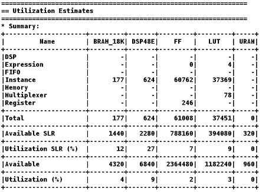
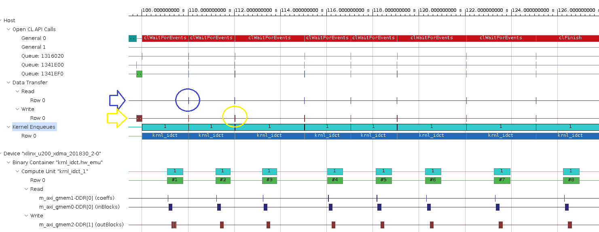
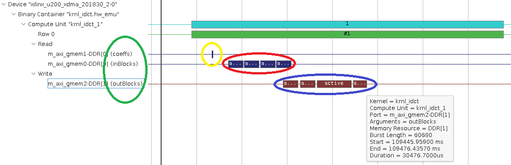

# Application Performance Analysis

In this lab we will have a look at the different types of reports produced by Vitis during emulation and FPGA/hardware runs and see how we can uses these reports to analyze different performance metrics and identify potential for performance improvement. 

**NOTE**: We will use most of the emulation results created by different runs performed in the last lab, if you have not completed this lab please complete it first.

### Analyzing the Reports  

This section covers how to locate and read the various reports generated by the emulation runs. The goal of this section is to understand the analysis reports generated by Vitis before utilizing them in next sections.  

#### Profile Summary report

After hardware emulation run completes, a run summary is generated in the `build_hw_emu` folder. The summary can be opened with Vitis Analyzer.

Open the generated run summary report as follows:

```
vitis_analyzer ./build_hw_emu/xclbin.run_summary
```

After Vitis_analyzer opens run summary, from left hand side pan select "**Profile Summary**" to open it in the main window on right hand side.

  

  This report provides data related to how the application runs. Notice that the report has four tabs at the top: **Top Operations**, **Kernels & Compute Units**, **Data Transfers**, and **OpenCL APIs**.

  Click through and inspect each of the tabs:

  * **Top Operations**: Top operations tab provides metrics in terms of completion/execution times for kernel and data transfers between host and the device global memories giving at glance view of any potential performance bottlenecks. This allows you to identify throughput bottlenecks when transferring data or during kernel execution which ever is the slowest. Efficient transfer of data to the kernel/host allows for faster execution times.

  * **Kernels & Compute Units**: Shows the number of times the kernel was executed. Includes the total, minimum, average, and maximum run times. If the design has multiple compute units, it will show each compute unit’s utilization. When accelerating an algorithm, the faster the kernel executes, the higher the throughput which can be achieved. It is best to optimize the kernel to be as fast as it can be with the data it requires. In this table some numbers give key insight into potential for performance improvement. CU unit utilization being small essentially hints that CU was not busy processing data most of the time but waiting for data to arrive from host. Another important number to look for is dataflow acceleration, it tells us about potential for acceleration using dataflow hardware optimization that can be applied to kernel.

  * **Data Transfers**: This tab has no bearing in software emulation as no actual data transfers are emulated across the host to the platform. In hardware emulation, this shows the throughput and bandwidth of the read/writes to the global memory that the host and kernel share. During hardware emulation these number give relatively accurate numbers, but generally hardware emulation is very slow and data set size used are smaller hence these number doesnt reflect very accurate picture We will use these number for analysis in a realistic fashion in next lab while running on hardware where we can experiment with larger data sets.

  * **OpenCL APIs**: Shows all the OpenCL API command executions, how many time each was executed, and how long they take to execute or how much time was spent during which this call was active.

3. Click on the **Kernels & Compute Units** tab of the **Profile Summary** report, locate and note the following numbers:

  - Kernel Total Time (ms):

This number will serve as reference point to compare against after optimization.    

#### HLS reports

The Vitis v++ compiler also generates **HLS Reports** for each kernel. **HLS Reports** explain the results of compiling the kernel into hardware. It contains many details (including clocking, resources or device utilization) about the performance and logic usage of the custom-generated hardware. These details provide many insights to guide the kernel optimization process. We want to build an xclbin file ( FPGA Binary File) with four different kernels so there will be 4 different reports for each kernel, for actual application we need only one kernel other three are added for experimental purposes as pointed out in previous lab also, we will use them in next labs and give out further details.  

1.  Locate the HLS reports:
    ```bash
    cd $LAB_WORK_DIR/Vitis-AWS-F1-Developer-Labs/modules/module_01/idct/
    find . -name "*_csynth.rpt"
    ```
    This find command will return many results but the four reports of concern to us are:
    ```bash
    ./build_hw_emu/reports/krnl_idct_noflow.hw_emu/hls_reports/krnl_idct_noflow_csynth.rpt
    ./build_hw_emu/reports/krnl_idct_med.hw_emu/hls_reports/krnl_idct_med_csynth.rpt
    ./build_hw_emu/reports/krnl_idct.hw_emu/hls_reports/krnl_idct_csynth.rpt
    ./build_hw_emu/reports/krnl_idct_slow.hw_emu/hls_reports/krnl_idct_slow_csynth.rpt
    ```
    These are Vitis HLS reports for kernels **krnl_idct** , **krnl_idct_med**, **krnl_idct_slow** and **krnl_idct_noflow**. We will have a look at these reports and the kernel sources to figure out the differences in terms of resources usage and performance.
1.  Open the **./build_hw_emu/reports/krnl_idct.hw_emu/hls_reports/krnl_idct_csynth.rpt** file, scroll to the **Performance Estimates** section, locate the **Latency (clock cycles)**  summary table and note the following performance numbers:
    - Latency (min/max):
    - Interval (min/max):
    
    These numbers reported in the table give performance expectation from the kernel in terms of clock cycles and also in time units. 
    
    

1. The next thing to look for in the same report is estimate for hardware resources used by this kernel on FPGA. Look for Utilization Estimates section, it should look similar to the following table:

      
    
    From this table we can see resource usage for this kernel in absolute numbers and percentage of total resources on FPGA. The main resources on the FPGA are Digital Signal Processing modules (DSPs), block RAM memory modules (BRAMs), Flip Flops (FFs) and Look up tables (LUTs). You can note down these resources to compare with the implementation of other hardware kernels.
1. Next open the following report for kernel **kernel_idct_slow**:
    ```bash
   ./build_hw_emu/reports/krnl_idct_slow.hw_emu/hls_reports/krnl_idct_slow_csynth.rpt
    ```
    you can note down latency, interval and resource usage for this kernel it will be less than the kernel we saw earlier. This kernel is explicitly made to have larger latency at the advantage of using less resources. Next we will see how we have generated these two kernel with minor difference which is in terms of **HLS Pragma** that we have used for loop pipelining. To do this:
    
     - First open file source file **krnl_idct.cpp**: 
        ```bash
        vim $LAB_WORK_DIR/Vitis-AWS-F1-Developer-Labs/modules/module_01/idct/src/krnl_idct.cpp
        ```
       and go to label "PIPELINE_PRAGMA" near line no.297: an HLS pragma is placed here for loop pipelining and note down II=2 constraint, which means back to back loop iteration should start after every 2 cycles ( e.g. next loop iteration should start processing after two cycles of current iteration and they should do processing in an overlapping fashion).
       
   - Now open file for seconds kernel **krnl_idct_slow.cpp**:
        ```bash
        vim $LAB_WORK_DIR/Vitis-AWS-F1-Developer-Labs/modules/module_01/idct/src/krnl_idct_slow.cpp
go to label "PIPELINE_PRAGMA" near line no.297 you will notice here the II constrains is 8, which mean back to back loop iterations within the body of which this constraint is placed, should start after 8 cycles. This room of 8 cycles allows Vitis HLS tool to share resources if possible and hence better resource utilization. Similarly you can have a look at third kernel namely **krnl_idct_med** which has II=4 constraint and compare resources. _Generally increasing II can reduce resources but it may not be a linear relation depending on the availability of resources in design itself which can be shared._
       
#### Application Timeline report

In addition to the profile summary file, the emulation run also generates an timeline trace file as part of run summary. This gives more details:
- about full application behavior
- the interactions with FPGA and 
- execution times on hardware side (FPGA Card).

We can analyze this report for host side application issues and other things like:
 - looking at specific data transfer rates
 - kernel execution times for different enqueued operations. 
 
 Essentially a timeline describes application lifetime with annotations for data transfer sizes, transfer times and bandwidth utilization. The timeline also gives event dependencies between different enqueued tasks such as memory transfers and kernel execution. These dependencies can be seen by simple mouse click on any task on timeline trace.  

Open the generated run summary report:

```
vitis_analyzer build_hw_emu/xclbin.run_summary 
```

After Vitis_analyzer opens run summary, from left hand side pan select "**Application Timeline**" to open it in the main window on right hand side.




The **Application Timeline** collects and displays host and device events on a common timeline to help you understand and visualize the overall health and performance of your systems. These events include OpenCL API calls from the host code: when they happen and how long each of them takes.
Application Timeline has two distinct sections for **Host** and **Device**.

##### Host Application Timeline
Host side uses multiple sets of OpenCL buffers. Each set contains 2 input and 1 output buffer sufficient for single kernel call. Multiple set of buffers help to enqueue multiple kernel calls at the same time. It uses a pool of buffers based on a circular pointer. At the start host enqueues multiple kernel calls and corresponding memory transfers using this pool of buffers. Once the complete pool is exhausted, the application checks for a set of buffers which is free after being used by any kernel enqueued previously. If a set of free buffers is available for kernel input and output a new task is again enqueued with new I/O data. The dependencies between data transfers and kernel execution are created in a fashion described below:

  * Data transfers from host to device global memory don't depend on anything and hence they can pretty much complete anytime before kernel execution which can be seen by zooming into the timeline as shown in the figure below and highlighted by yellow ellipse
 
  * Kernel execution/enqueues depend on host to device data transfers and also on any kernel enqueue that was done before, so they complete after related transfers and previous kernel enqueues. In the timeline below yellow ellipse shows start of next kernel enqueue happening after data transfer and it also happens when previous kernel enqueue operation has finished marked in red ellipse.
  
  * Transfers from host to device depend on kernel execution so they always complete after kernel enqueue calls complete. It is shown by operation in below ellipse as it happens after previous kernel enqueue operation finishes marked by red ellipse.
  
     
    
  All the **stated dependencies** can also be checked by clicking on any enqueue call it will **display arrow connections** which shows dependencies as specified by application programmer on host side using **OpenCL APIs** while enqueuing different operations.

##### Device Execution Timeline    
Device side timeline trace gives details of activity happening on the FPGA device or acceleration card. Here you can find actual hardware activity happening for different CUs, for IDCT we are using only one instance of IDCT kernel so a single CU. All its interfaces to device global memory are traced out. In the case of IDCT it uses three separate interfaces one for co-efficients, second for input data and third for output data ( even though two of these interfaces for co-efficients and input data use same DDR memory bank). You can zoom into one of the read/write transactions happening on device master AXI interfaces as shown in the figure below and see how fast these data transfers are happening and in which sort of bursts, the timeline will show different bursts and also burst lengths. Different colored ellipses are used to highlight interfaces and data movements happening on different interfaces between device DDR memories and kernel:

* Green ellipse highlights read and write interfaces with same port names as used in kernel C/C++ description 
* Yellow ellipse highlights movement of co-efficients
* Red ellipse highlights movement of input data from device memory to kernel and blocks within the transaction show different no. of burst that happened.
* Blue ellipse highlights data movement from kernel to device memory in different bursts, by hovering mouse on these burst it displays a tooltip with burst statistics ( kernel, compute, start, stop, size, data rate etc.).

 You can also note that since IDCT coefficients and input data use same DDR memory bank and happen in non-overlapping fashion whereas output write operation has some overlap with device read operation because it uses a separate DDR memory bank.  In next labs we will see maximizing this kind of overlap considerably improve application performance.


 


### Summary  

In this lab, you learned:
* About different type of reports produced by Vitis
* How to read these reports for important metrics
* How to analyze timeline traces for host and device efficiency and potential improvements


In the next labs you will utilize these analysis capabilities to drive and measure code optimizations both for host and kernel performance improvements.

---------------------------------------

<p align="center"><b>
Start the next lab: <a href="lab_04_idct_optimization.md">IDCT Kernel Hardware Optimizations and Performance Analysis</a>
</b></p>  
 