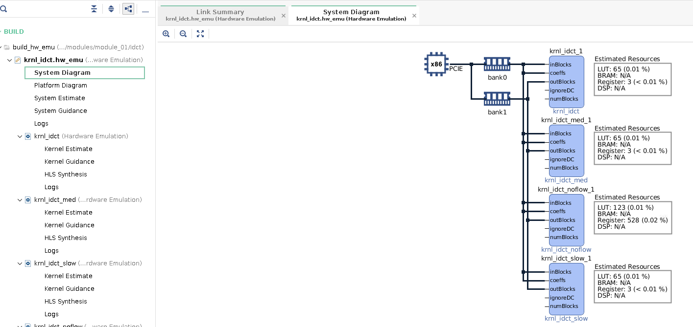
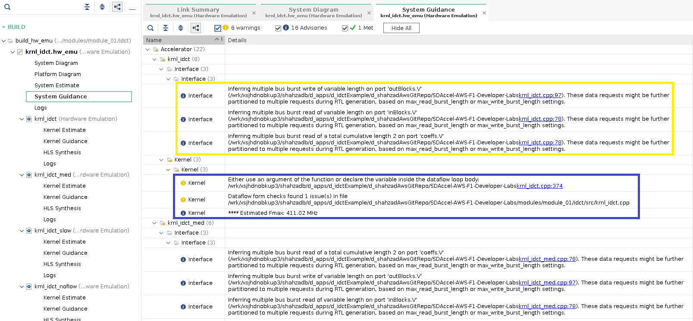
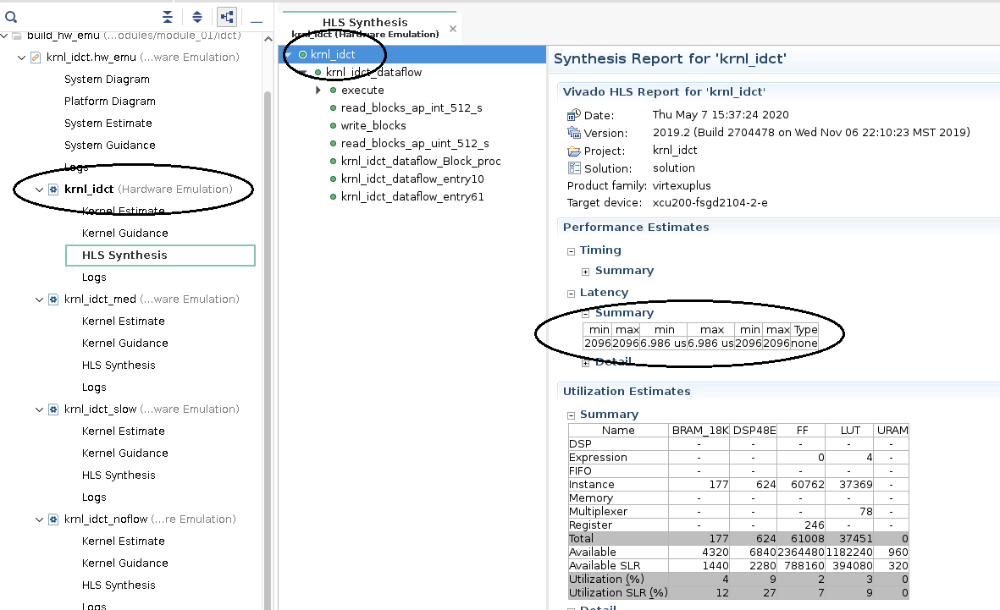
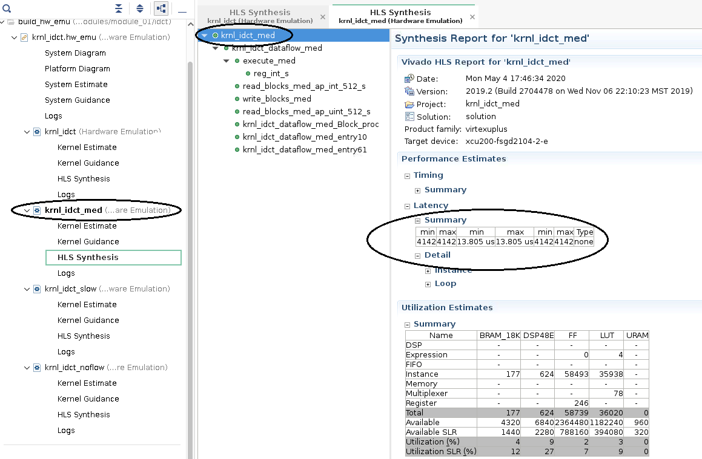

# Application Performance Analysis

- [Analyzing the Reports](#analyzing-the-reports)
- [Profile Summary Report](#profile-summary-report)
- [Vitis Link Summary and HLS reports](#vitis-link-summary-and-hls-reports)
- [Application Timeline report](#application-timeline-report)
  - [Host Application Timeline](#host-application-timeline)
  - [Device Execution Timeline](#device-execution-timeline)
- [Summary](#summary)

In this lab we will have a look at the different types of reports produced by Vitis during emulation and FPGA/hardware runs. We will use these reports to analyze performance metrics and identify potential for performance improvement. 

**NOTE**: We will use most of the emulation results created by different runs performed in the last lab, if you have not completed this lab please complete it first.

## Analyzing the Reports  

This section covers how to locate and read the various reports generated by the emulation runs. The goal of this section is to understand the analysis reports generated by Vitis before utilizing them in next sections.  

### Profile Summary Report

After hardware emulation run completes, a run summary is generated in the `build_hw_emu` folder. The summary can be opened with Vitis Analyzer.

Open the generated run summary report as follows:

```
vitis_analyzer ./build_hw_emu/xclbin.run_summary
```

After Vitis_analyzer opens run summary, from left hand side pan select "**Profile Summary**" to open it in the main window on right hand side.

  

  This report provides application run data. Notice that the report has four tabs at the top: **Top Operations**, **Kernels & Compute Units**, **Data Transfers**, and **OpenCL APIs**.

  Click through and inspect each of the tabs:

  * **Top Operations**: Top operations tab provides metrics in terms of completion/execution times for kernel and data transfers between host and the device global memories giving at glance view of any potential performance bottlenecks. This allows you to identify throughput bottlenecks when transferring data or during kernel execution which ever is the slowest. Efficient transfer of data to the kernel/host allows for faster execution times.

  * **Kernels & Compute Units**: Shows the number of times the kernel was executed. Includes the total, minimum, average, and maximum run times. If the design has multiple compute units, it will show each compute unit’s utilization. When accelerating an algorithm, the faster the kernel executes, the higher the throughput which can be achieved. It is best to optimize the kernel to be as fast as it can be with the data it requires. In this table some numbers give key insight into potential for performance improvement. CU unit utilization being small essentially hints that CU was not busy processing data most of the time but waiting for data to arrive from host.

  * **Data Transfers**: This tab has no bearing in software emulation as no actual data transfers are emulated across the host to the platform. In hardware emulation, this shows the throughput and bandwidth of the read/writes to the global memory that the host and kernel share. During hardware emulation these number give relatively accurate numbers, but generally hardware emulation is very slow and data set size used are smaller hence these number doesnt reflect very accurate picture. We will use these number for analysis in a realistic fashion in next lab while running on hardware where we can experiment with larger data sets.

  * **OpenCL APIs**: Shows all the OpenCL API command executions, how many time each was executed, and how long they take to execute or how much time was spent during which this call was active.

Click on the **Kernels & Compute Units** tab of the **Profile Summary** report, locate and note down the Kernel Total Time (ms).


### Vitis Link Summary and HLS reports

Vitis v++ compiler also generates **HLS Reports** for each kernel. **HLS Reports** contain the results of compiling kernel into hardware. It contains many details (including clocking, resources or device utilization) about the performance and logic usage of the custom-generated hardware. These details provide many insights to guide the kernel optimization process. We want to build an xclbin file ( FPGA Binary File) with four different kernels so there will be 4 different reports for each kernel. For actual application we need only one kernel other three are added for experimental purposes as pointed out in previous lab also, we will use them in next labs and give out further details. We will use Vitis Link Summary which contains all of these reports.   

1.  Opening the link summary:

    ```bash
    cd $LAB_WORK_DIR/Vitis-AWS-F1-Developer-Labs/modules/module_01/idct/
    vitis_analyzer build_hw_emu/krnl_idct.hw_emu.awsxclbin.link_summary
    ```
    
    The figure below shows the main window opened by vitis_analyzer:
    
     
     
     In the left hand side panel it first list details of link summary then compile summary for each kernels. We will first have a look at somethings from link summary. In the left hand side panel click on **System Diagram**. It bring up a system diagram as shown below:
      
    
    
    This diagram shows number of compute units and how they connect to different memory banks and also the host PCIE connection.
    
    Vitis Analyzer also provides important guidance about the kernel compilation or HLS process which can be seen by selecting **System Guidance** as shown in figure below:
    
    
    
    System guidance provides important information about hardware compile and link process for every kernel. In this case guidance about **burst inference** on different kernel memory ports is provided. The messages say that multiple read and write bursts of variable length are inferred on kernel ports. _Burst memory transfer over AXI interfaces generally have better throughput than non-burst transfers_.

1.    
    Next open synthesis reports and compare them for kernel latencies and resource usage.
    * To do this first select "krnl_idct" to bring the report as shown in figure below. Note down latency(min/max) and resource utilization. From resource utilization table we can see resource usage for the kernels in absolute numbers and percentage of total resources on FPGA. _The main resources on the FPGA are Digital Signal Processing modules (DSPs), block RAM memory modules (BRAMs), Flip Flops (FFs), URAMs and Look up tables (LUTs)._
    
    
   
   *    Next open the HLS synthesis report for "krnl_idct_med" a note down latency and resource utilization, the report for this kernel will be as shown below, note down the latency(min/max) and resource utilization
   
    
    
   *   Lastly open the report for the third kernel namely "krnl_idct_slow" and note down latency(min/max) and resources. 
         

From the latency numbers for all the kernels it should be clear that "krnl_idct" has the minimum latency and "krnl_idct_slow" has the maximum latency. These kernels are explicitly designed to have these latencies to perform some experiments.

Next we will see how we have generated these kernels with minor difference which is in terms of **HLS Pragmas** that we have used for loop pipelining and dataflow optimization. To do this:
    
 - First open file source file **krnl_idct.cpp** and go to label "PIPELINE_PRAGMA" near line 297:
 
    ```bash
    vim $LAB_WORK_DIR/Vitis-AWS-F1-Developer-Labs/modules/module_01/idct/src/krnl_idct.cpp
    ```
   
    an HLS pragma is placed here for loop pipelining and note down II=2 constraint, which means back to back loop iteration should start after every 2 cycles ( e.g. next loop iteration should start processing after two cycles of current iteration and they should continue execution in an overlapping fashion).
       
- Now open file for second kernel **krnl_idct_slow.cpp**  go to label "PIPELINE_PRAGMA" near line 297:

    ```bash
    vim $LAB_WORK_DIR/Vitis-AWS-F1-Developer-Labs/modules/module_01/idct/src/krnl_idct_slow.cpp
    ```
    
    you will notice here the II constrains is 8. This constraint allows Vitis HLS tool to share resources if possible and hence decrease resource utilization. Similarly you can have a look at third kernel namely **krnl_idct_med** which has II=4 constraint and compare resources. _Generally increasing II can reduce resources but it may not be a linear relationship depending on the availability of resources in the design itself with the potential for getting shared._
       
### Application Timeline report

In addition to the profile summary file, the emulation run also generates an timeline trace file as part of run summary. This gives more details about:
- Full application behavior
- The interactions with FPGA
- Execution times on hardware side (FPGA Card).

We can analyze this report for host side application issues and other things like:
 - Looking at specific data transfer rates
 - Kernel execution times for different enqueued operations. 
 
 Essentially a timeline describes application lifetime with annotations for data transfer sizes, transfer times and bandwidth utilization. The timeline also gives event dependencies between different enqueued tasks such as memory transfers and kernel execution. These dependencies can be seen by simple mouse click on any task enqueue on host side timeline trace.  

Open the generated run summary report:

```
vitis_analyzer build_hw_emu/xclbin.run_summary 
```

After Vitis_analyzer opens run summary, from left hand side pan select "**Application Timeline**" to open it in the main window on right hand side.


The **Application Timeline**  shown above collects and displays host and device events on a common timeline to help you understand and visualize the overall health and performance of your system. These events include OpenCL API calls from the host code, about when they happen and how long each of them takes. For example the rows marked by blue and yellow arrows trace read and write data movements from host side. The events inside blue and yellow circles show actual data transfers happening on this timeline. Application Timeline has two distinct sections for **Host** and **Device**.

#### Host Application Timeline
Host side uses multiple sets of OpenCL buffers. Each set contains 2 input and 1 output buffer sufficient for single kernel call. Multiple set of buffers help to enqueue multiple kernel calls at the same time. Host uses a pool of buffers based on a circular pointer. At the start host enqueues multiple kernel calls and corresponding memory transfers using this pool of buffers. Once the complete pool is exhausted, the host application checks for a set of buffers which is free after being used by any kernel call enqueued previously. If a set of free buffers is available for kernel input and output a new task is enqueued with new input data. The dependencies between data transfers and kernel execution are created in a fashion described below:

  * Data transfers from host to device global memory don't depend on anything and hence they can pretty much complete anytime before kernel execution which can be seen by zooming into the timeline as shown in the figure below and highlighted by yellow ellipse.
 
  * Kernel execution/enqueues depend on host to device data transfers and also on any kernel enqueue that was done before, so they complete after related transfers and previous kernel enqueues. In the timeline below yellow ellipse shows start of next kernel enqueue happening after data transfer and it also happens when previous kernel enqueue operation has finished marked in red ellipse.
  
  * Transfers from host to device depend on kernel execution so they always complete after kernel enqueue calls complete. It is shown by an operation in blue ellipse as it happens after previous kernel enqueue operation finishes marked by red ellipse.
  
     
    
  All the **stated dependencies** can also be checked by clicking on any enqueue call it will **display arrow connections** which shows dependencies as specified by application programmer on host side using **OpenCL APIs** while enqueuing different operations.

#### Device Execution Timeline    
Device side timeline trace gives details of activity happening on the FPGA device or acceleration card. Here you can find actual hardware activity happening for different CUs, for IDCT we are using only one instance of IDCT kernel so a single CU. All its interfaces to device global memory are traced out. In the case of IDCT it uses three separate interfaces one for co-efficients, second for input data and third for output data ( even though two of these interfaces for co-efficients and input data use same DDR memory bank). You can zoom into one of the read/write transactions happening on device master AXI interfaces as shown in the figure below and see how fast these data transfers are happening and in which sort of bursts, the timeline will show different bursts and also burst lengths. Different colored ellipses are used to highlight interfaces and data movements happening on different interfaces between device DDR memories and kernel:

* Green ellipse highlights read and write interfaces with same port names as used in kernel C/C++ description 
* Yellow ellipse highlights movement of co-efficients
* Red ellipse highlights movement of input data from device memory to kernel and blocks within the transaction show different number of bursts that happened.
* Blue ellipse highlights data movement from kernel to device memory in different bursts, by hovering mouse on these burst it displays a tooltip with burst statistics ( kernel, compute, start, stop, size, data rate etc.).

 You can also note that since IDCT coefficients and input data use same DDR memory bank and happen in non-overlapping fashion whereas output write operation has some overlap with device read operation because it uses a separate DDR memory bank.  In next labs we will see maximizing this kind of overlap considerably improves application performance.


 


## Summary  

In this lab, you learned:
* About different type of reports produced by Vitis
* About Vitis Link Summary
* How to read these reports for important metrics
* How to analyze timeline traces for host and device efficiency and potential improvements


In the next labs you will utilize these analysis capabilities to drive and measure code optimizations both for host and kernel performance improvements.

---------------------------------------

<p align="center"><b>
Start the next lab: <a href="lab_04_idct_optimization.md">IDCT Kernel Hardware Optimizations and Performance Analysis</a>
</b></p>  
 