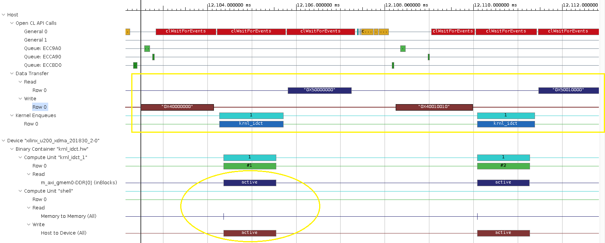

## Host Host Code Performance Optimizations and Wrap Up
In this lab we will experiment with host code optimization that will bring us a big performance improvement. Finally we will wrap up this module by showing different steps on how to close your RDP session and stop your instance. It is important to always stop or terminate AWS EC2 instances when you are done using them. This is a recommended best practice to avoid unwanted charges.
 
In the following sections we will launch the application on F1 instance and analyze application execution using timeline and figure out potential for significant performance improvement, to do this please proceed as follows.

### Select Right Kernel for Execution
1. Modify host code to make sure it runs appropriate hardware kernel. Open terminal if you don't have it already open from last lab and do:

    ```bash
    source $AWS_FPGA_REPO_DIR/vitis_setup.sh
    export LAB_WORK_DIR=/home/centos/src/project_data/
    cd $LAB_WORK_DIR/Vitis-AWS-F1-Developer-Labs/modules/module_01/idct
    ```

    Now open host.cpp and make changes so that hardware run will use kernel namely "krnl_idct": 

    ```bash
    vim src/host.cpp
    ```  

    Go to label "CREATE_KERNEL" near line no.226 and make sure the kernel name string is **"krnl_idct"** and not anything else and compile host application again:

    ```bash
    make compile_host TARGET=hw
    ```
### Launch Application and generate Reports
1. Run application as follows by first sourcing runtime setup script if you have not done so before:

    ```bash
    source $AWS_FPGA_REPO_DIR/vitis_runtime_setup.sh 
    cd $LAB_WORK_DIR/Vitis-AWS-F1-Developer-Labs/modules/module_01/idct
    ./build/host.exe ./xclbin/krnl_idct.hw.awsxclbin $((1024*128)) 32 1
    ```
   You will see an output similar to the one given below with an acceleration about 11x faster than CPU
   
   ```
    Execution Finished
    =====================================================================
    ------ All Task finished !
    ------ Done with CPU and FPGA based IDCTs
    ------ Runs complete validating results
    CPU Time:        1.86819 s ( 1868.19ms )
    CPU Throughput:  274.062 MB/s
    FPGA Time:       0.166588 s (166.588 ms )
    FPGA Throughput: 3073.45 MB/s
    ------ TEST PASSED ------
    =====================================================================
    FPGA accelerations ( CPU Exec. Time / FPGA Exec. Time): 11.2145
    =====================================================================
   ```
   The system run will also create a profile summary and application timeline in the run folder (idct here) open application timeline:
   
   ```bash
   vitis_analyzer ./xclbin.run_summary
   ```
   
   Now in the host side application timeline part go to first write transaction and zoom in appropriately and you will see a timeline similar to the one shown below:
   
       
      
  In next section we will try to comprehend this waveform and will perform host side code optimization to improve performance.

### Application Performance Analysis

#### Profile Summary : Compute Unit Utilization
Now lets open profile summary and by looking at the profile summary and timeline find potential for performance improvement. To open the profile summary proceed as follows:

1. In the run directory (idct) open profile summary

    ```bash
   vitis_analyzer ./build/xclbin.run_summary
    ```
   Now from left hand side panel select **"Profile Summary"** and from the profile summary view go to **"Kernels and Compute Units"** and you will see numbers as shown in the figure below:
   
       
      
  It shows that compute unit utilization is around 23%. Meaning compute unit is busy crunching numbers only for 23% of the time and remaining 77% of time it is stalled/idling. This can be confirmed from the application timeline and which also provides insights why it is so. 
  
 #### Application Timeline Analysis 
 
 By looking at the waveform we can observe that:
 
 *  Host sends data through PCI on write interface for processing and only once the data transfer completes the enqueued kernel can kick starts compute unit.
 
 * Once the compute unit finishes processing current batch of input data only then  output data produced by kernel requested by host enqueue start to flow.
 
 * Whole of this cycle then repeats again and again till all batches of input are processed.
     
 One very important thing to note is that host does all of these transactions sequentially, only initiating new transaction (task getting enqueued on command queue) after previous one is finished. Given that most of the PCI and DDR interfaces have support for full duplex transports we can do number of optimizations by doing the dependency analysis.
 
 #### Task Dependency Analysis 
  
  - **Input Data:** The host side writes to device memory can  continue in background back to back since it is input data coming from host to device for processing and has no dependencies
  
  - **Kernel Compute:** Kernel can be enqueued with dependency on corresponding input data and can kick start as soon as this data is transferred to device
  
  - **Output Data Transfer to Host:** Next Kernels Compute has no dependency on output data calculated by current kernel call and transferred back to host. The output data transfer for current compute can continue in background while next kernel compute can start.
 
 In nutshell this dependency analysis clarifies and reveals that:
  - While kernel is processing current data block host can start sending next input data block for next kernel compute
  - kernel/CU can start processing next input data block as soon as it becomes available
  - the output data transfer to host (produced by kernel/CU execution) can start as soon as current kernel/CU call finishes and continue in background while kernel/CU starts processing next input block. 
  
Once we have identified these facts we can capture relevant and required dependencies on host side and improve the performance considerably.

### Optimizing Host Application Code for Performance

In this section we will try to dissect the application host code and understand how it is structured and which kind of objects are used to capture the behavior and dependencies as we discussed in last section to gain maximum performance.

#### Capturing Task Dependencies
 
This section we will explore how host code captures dependencies. Please proceed as follows:

1. Open application source code in file "idct/krnl_idct_wrapper.cpp"

    ```bash
    vim idct/src/krnl_idct_wrapper.cpp
    ```
    The host code that deals with FPGA accelerator and coordinates most of its activity is organized in two different files as explained in one the previous labs also, namely:
     * "host.cpp" and 
     * "krnl_idct_wrapper.cpp".
      
    The code in "host.cpp" deals with the creation of objects such as command queue, context, kernel and loads FPGA with binary that contains compiled kernels. The piece of host code inside "krnl_idct_wrapper.cpp" is organized in a function body to make it callable inside a std::thread.
     
1.  After opening "krnl_idct_wrapper.cpp" go to label "EVENTS_AND_WAIT_LISTS" near line no.48: 

    Here event vectors are defined that will hold events generated by different tasks (read/write/kernel execute) when they complete. How the lengths of vectors is chosen will be explained in next section. These events help link different tasks by letting us define one event generated by completion of on task as dependency or blocking condition for another task. 
    - **writeToDeviceEvent** is a vector which holds events which are generated once the host finishes transfer of input data from host to device. These events can trigger enqueued kernel and hence start compute unit.
    
    - **kernelExecEvent** is vector of events which indicates kernel compute has finished.
     
    - **readFromDeviceEvent** represents events generated when host finishes reading output data from device memory. 
       
#### Batching and Pool of Buffers

##### Duplicating Input and Output Buffers 

For using IDCT kernel we need three buffers for:

- input data
- input IDCT co-efficients
- output data

Since we want to design host side such that we can overlap different operations so we need to have duplicate buffers for all inputs and outputs kernel needs to process per call. Host application has a parameter called **maxScheduledBatches** which is used to define the level of duplicity, essentially how many buffers for storing different inputs or outputs for multiple kernel calls. The host application is written such that this parameter can be passed to host application at command line as argument.
 
 - **maxScheduledBatches = 1:**  Setting its value to 1 essentially means we have one buffer for storing only one input and output block. Because of this we cannot issue multiple memory movements commands and kernel enqueues at the same time hence no overlapping of transactions can happen from host side. So write to device, kernel execution and read back from device all happen sequentially
 
  - **maxScheduledBatches > 1:**  Setting it to a value greater than 1 means we have duplicate resources (multiple set of input and output buffers ) and we can potentially enable overlapping transactions from host side
   
  You can also observe that **maxScheduledBatches** is the parameter which sizes all other vectors such as event vectors and wait list. To understand how **maxScheduledBatches > 1** enable overlapping of different operations lets define:
   
  **Full Transaction**: is a as set of following enqueue operations from host for single kernel call:
   
  * write input data to device
  * execute kernel
  * read output data from device
  
  With multiple buffers available for each set of input and output  data buffers(maxScheduledBatches > 1) we can conceptually enqueue multiple full transactions on command queue at a time which will potentially set stage for overlapping between execution of different full transactions.
 
 ##### Multiple Command Queues
 
  Given the potential created by **maxScheduledBatches > 1**, To achieve the overlapping transactions host uses three different in order command queues:
  - One is used to enqueue all the tasks that move input data to device
  - Another is used to enqueue all kernel executions
  - Third one is used to enqueue all device to host output data movements
  
  The in order queues are used to make sure that data dependencies between multiple similar tasks ( like moving input data for 2nd kernel call should not happen before input data for 1st kernel call has finished since it may create contention at memory interface and lower performance) are defined implicitly.
  
  Now to understand main loop that does all task enqueueing and resource management please go to label "BATCH_PROCESSING_LOOP" near line no.68 and observe the following:
  - This loop has total number of iterations equal to maximum number of batches to be processed (passed as application commandline argument)
  - One batch is processed by a single kernel call
  - Initially when this loop starts it will schedule multiple full transactions  equal to **maxScheduledBatches**, essentially starts using all the buffer resources allocated and defined by maxScheduledBatches > 1
  - After this it will wait for very first "full transaction" to complete by using a **earlyKernelEnqueue** pointer which always points to earliest enqueued "full transaction" still not finished ( meaning write to device, kernel execute and output data read back not complete).
  - Once the earliest enqueued "full transaction" is finished it will re-uses these buffers for enqueueing the next full transaction for next batch of input data.
  - This loop continues till all the batches are processed.
  
  After this loop finishes we wait on command queue for all the operation to finish. We only wait on the command queue that was used enqueue output data transfers from device to host since these are the last operations to happen and implicitly signal end of processing.
  
  After all these details it should be clear that host code is designed to mimic full sequential host side execution by using **maxScheduledBatches=1** and overlapping pipelined transactional behavior by using **maxScheduledBatches > 1** 
 
 #### Running Application with Software Pipeline   
Now that we have explained in the previous section in detail how we can create a software pipeline on host side using pool of buffers and multiple command queues lets experiment with it and see how performance changes. Please proceed as follows:

1. Run application again, note that the final commandline argument is **4** instead of **1** as was the case in previous run which will enable host side write/execute/read overlapping (software pipeline). 

    ```bash
    cd $LAB_WORK_DIR/Vitis-AWS-F1-Developer-Labs/modules/module_01/idct
    ./build/host.exe ./xclbin/krnl_idct.hw.awsxclbin $((1024*128)) 32 4
    ```
    You will see an output message like the one below and you can see the **performance has almost improved by 2x or more**.
    
    ```
    Execution Finished
    =====================================================================
    ------ All Task finished !
    ------ Done with CPU and FPGA based IDCTs
    ------ Runs complete validating results
    CPU Time:        1.90758 s ( 1907.58ms )
    CPU Throughput:  268.403 MB/s
    FPGA Time:       0.0793128 s (79.3128 ms )
    FPGA Throughput: 6455.45 MB/s
    ------ TEST PASSED ------
    =====================================================================
    FPGA accelerations ( CPU Exec. Time / FPGA Exec. Time): 24.0513
    =====================================================================
    ```

1. To confirm that now read/write and execute transactions are overlapping (software pipeline is created) you can again open application timeline re-created by the last run, it should show timeline similar to the one shown in figure below:

    ```bash
    vitis_analyzer ./xclbin.run_summary
    ```
   
    
1. Another interesting thing to look for is compute unit utilization:
*   Please open the profile summary and have a look at compute unit utilization
*   it should have gone up from 23% to something more than 70%

which means it is now idling considerably less than what it was before we created this software pipeline on host side.
     
 


\
\
NOTE: If the compute unit utilization in this case was still less than 50% and we have also found out that performance bottleneck is not compute unit but something else like  memory bandwidth or some other block working in pipeline with it, we could have increased the II by 2x to 4 which may have allowed us to save resources on FPGA.

### Summary  

In this lab, you learned:
* How to critically look at application timeline and profile summary
* Identify potential for performance improvements from application timeline
* Identify task that can overlap to create a software pipeline  
* Optimize host code to enable software pipelining for performance improvements

---------------------------------------

### Stopping your instance

* Click the 'X' icon to close your RDP client.
* On your local machine, return to your browser and to the tab showing the **EC2 Console** and the details of your running instance.
   * If necessary, use the link which was emailed to you to return to the proper web page.
* In the **EC2 Console**, make sure you instance is selected
* Click the **Actions** button, select **Instance State** and then click **Stop** or **Terminate**.
   * Use **Stop** if you want to rapidly restart this instance later
   * Use **Terminate** if you want to permanantly delete this instance and its contents

### Congratulations!

You have successfully completed the first module of Vitis AWS F1 Developer Labs.


### Next steps

More modules will be added to the Vitis AWS F1 Developer Labs over time. In the meantime, you can continue learning about AWS F1 and Vitis by exploring the following resources:

| Resource | Title                       | Description  |
| -------- |---------------------------- | ----- |
| Video  | **Learn more about the Vitis OpenCL application structure** | This video introduces the host code and kernel elements of an OpenCL application and explains how they map to Xilinx FPGAs. [**Click here**](https://www.xilinx.com/video/hardware/opencl-application-structure.html). |
| Tutorial | **Get started on F1 with the Vitis C/OpenCL flow** | This guide takes new users through all the steps required to build a first working application on F1. [**Click here**](https://github.com/Xilinx/SDAccel-Tutorials/blob/master/docs/aws-getting-started/CPP/README.md). |
| Tutorial | **Get started on F1 with the Vitis RTL flow** | This guide is targeted to developers with prior hardware design experience and legacy RTL designs. [**Click here**](https://github.com/Xilinx/SDAccel-Tutorials/blob/master/docs/aws-getting-started/RTL/README.md). |
| Documentation | **Vitis HTML Documentation** | Learn how to get the most out of the Vitis development environment. [**Click here**](https://www.xilinx.com/html_docs/xilinx2018_3/Vitis_doc/). |
| F1 App | **Vitis Apps and Libraries** | Check-out the growing list of accelerated application and libraries available today. [**Click here**](https://www.xilinx.com/products/design-tools/acceleration-zone.html#libraries). |
| F1 App | **Test-drive Xilinx GoogLeNet / ResNet on AWS F1** | See for yourself how Xilinx can accelerate machine learning image classification on AWS F1. [**Click here**](https://aws.amazon.com/marketplace/pp/B077FM2JNS). |

---------------------------------------

<p align="center"><b>
Return to the beginning: <a href="../../README.md">Vitis AWS F1 Developer Labs</a>
</b></p>
