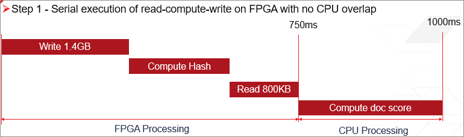
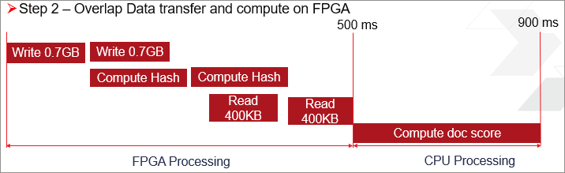
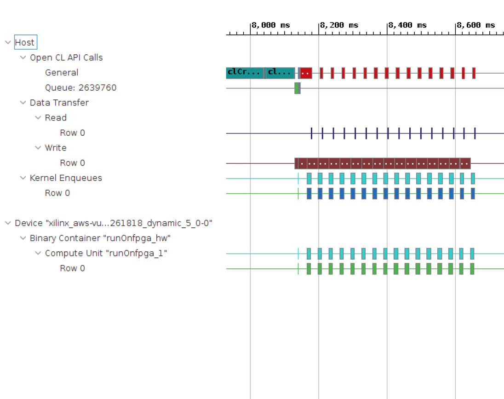

# Part 2: Data Movement Between the Host and Kernel

## Step 1: Naive Approach 

In this step, you are transferring the entire input buffer of 1.4GB from the host to the FPGA in one iteration followed by compute and reading the output from the FPGA to the host. The following figure shows a pictorial representation of the read-compute-write pattern in this step

  

The FPGA kernel code is already given, which computes the hash values for words in the document and returns back to the host.

The input arguments to the kernel are as follows:

* `input_doc_words`: Input array which contains the 32-bit words for all the documents.
* `bloom_filter`: Bloom filter array which contains the inserted hash values of search array.
* `total_size`: Unsigned int which represents the total size processed by the FPGA when it is called.
* `load_weights`: Boolean which allows to load the `bloom_filter` array only once to the FPGA in the case of multiple kernel invocations.

The output of the kernel is as follows:

* `output_inh_flags`: Output array of 8-bit outputs where each bit in the 8-bit output indicates whether a word is present in the bloom filter which is then used for a post-computing score in the CPU.

### Run the Application

Go to the `makefile` directory and run the following command.

```
  make run STEP=single_buffer
```

   >**NOTE:** While running the `makefile`, you can add the argument `SOLUTION=1` to run the reference code, which already contains the above optimization.

The output is as follows.

```
--------------------------------------------------------------------
 Executed FPGA accelerated version  |  1030.6703 ms   ( FPGA 616.349 ms )
 Executed Software-Only version     |  3694.6240 ms
--------------------------------------------------------------------
 Verification: PASS
```

### Profile Summary Analysis

1. Change your working directory to `build/single_buffer`.

2. Run the following command to look at the Profile Summary Report.

   ```
   sdx_analyze  profile  –f html -i ./profile_summary.csv
   ```

* In the Profile Summary, in the *Kernel Execution* section, the kernel execution time displays as 175.286 ms.
* The theoretical number expected from the kernel running at 250M HZ clock and processing eight words in parallel is as follows:

   Number of words/(Clock freq * (Parallelization factor in Kernel) =    401022976/(250\*1000000\*8) = 174.86 ms

    As you can see, the compute time of kernel closely matches with the theoretical number. The time spent in data transfers can be seen from the *Top Memory Writes* and *Top Memory Reads* sections.
* The time spent is sum of time spent in writes and reads, that is 410.979 + 29.645 = 440.624 ms.

### Timeline Trace Analysis

 Run the following commands to view the Timeline Trace report.

```
sdx_analyze trace –f wdb -I ./timeline_trace.csv
sdx –workspace workspace –report timeline_trace.wdb
```

 The Timeline Trace displays as follows.


As you can see from the Timeline Trace, there is a sequential execution of operations starting from the data transferred from the host to the FPGA, followed by compute in the FPGA and transferring back the results from the FPGA to host.

### Conclusion

  From the above Profile Summary and Timeline Trace reports, you see that the kernel execution time closely matches with the expected theoretical number. There is sequential execution with the data transfers between the FPGA and host and compute in the FPGA. To further improve performance, you can look into overlapping data transfers and compute.

## Step 2: Optimized Approach (Overlap Data Transfer and Compute)

In the previous step, you noticed a sequential execution of the read, compute, and write (that is, the compute does not start until the entire input is read into the FPGA and similarly, the host read from the FPGA does not start until compute is done).

To improve the performance, you can send the input buffer in multiple iterations and start the compute for the corresponding iteration as soon as the data for the iteration is transferred.  Because the compute of each iteration is independent of the other iterations, you can overlap the data transfer of the next iteration and compute of the current iteration. The performance is expected to increase, because instead of the serial execution of the data transfer and compute, you are now overlapping the data transfer and compute. The following figure shows an illustrated representation of sending data as a whole, versus sending it in two buffers.

   

### Host Code Modifications
  
1. Change your working directory to `src/double_buffer`.

2. In the `run_fpga.cpp` file, replace lines 64 to 95 with the following.

  
  a. Create two sub buffers for "input_doc_words" & "output_inh_flags" as follows:

        // Make buffers resident in the device
        q.enqueueMigrateMemObjects({buffer_bloom_filter, buffer_input_doc_words, buffer_output_inh_flags}, CL_MIGRATE_MEM_OBJECT_CONTENT_UNDEFINED);
 
        // Create sub-buffers, one for each transaction 
        unsigned subbuf_doc_sz = total_doc_size/2;
        unsigned subbuf_inh_sz = total_doc_size/2;
 
        cl_buffer_region subbuf_inh_info[2];
        cl_buffer_region subbuf_doc_info[2];
 
        cl::Buffer subbuf_inh_flags[2];
        cl::Buffer subbuf_doc_words[2];
 
 
        subbuf_inh_info[0]={0, subbuf_inh_sz*sizeof(char)};
        subbuf_inh_info[1]={subbuf_inh_sz*sizeof(char), subbuf_inh_sz*sizeof(char)};
        subbuf_doc_info[0]={0, subbuf_doc_sz*sizeof(uint)};
        subbuf_doc_info[1]={subbuf_doc_sz*sizeof(uint), subbuf_doc_sz*sizeof(uint)};
        subbuf_inh_flags[0] = buffer_output_inh_flags.createSubBuffer(CL_MEM_WRITE_ONLY, CL_BUFFER_CREATE_TYPE_REGION, &subbuf_inh_info[0]);
        subbuf_inh_flags[1] = buffer_output_inh_flags.createSubBuffer(CL_MEM_WRITE_ONLY, CL_BUFFER_CREATE_TYPE_REGION, &subbuf_inh_info[1]);
        subbuf_doc_words[0] = buffer_input_doc_words.createSubBuffer (CL_MEM_READ_ONLY,  CL_BUFFER_CREATE_TYPE_REGION, &subbuf_doc_info[0]);
        subbuf_doc_words[1] = buffer_input_doc_words.createSubBuffer (CL_MEM_READ_ONLY,  CL_BUFFER_CREATE_TYPE_REGION, &subbuf_doc_info[1]);
 
        printf("\n");
        double mbytes_total  = (double)(total_doc_size * sizeof(int)) / (double)(1000*1000);
        double mbytes_block  = mbytes_total / 2;
        printf(" Processing %.3f MBytes of data\n", mbytes_total);
        printf(" Splitting data in 2 sub-buffers of %.3f MBytes for FPGA processing\n", mbytes_block);
 
  b. Create vector of events to coordinate the read, compute, and write operations for each of the two iterations that are only dependent on their respective iterations, which allows for overlap between the data transfer and compute.
  
        // Events 
        vector<cl::Event> wordWait;
        vector<cl::Event> krnlWait;
        vector<cl::Event> flagWait;
 
        printf("--------------------------------------------------------------------\n");
 
        chrono::high_resolution_clock::time_point t1, t2;
        t1 = chrono::high_resolution_clock::now();
 
   c. Set kernel arguments and enqueue the kernel to load the bloom filter coeffecients
   
        // Only load the bloom filter in the kernel
        cl::Event buffDone,krnlDone,flagDone;
        total_size = 0;
        load_filter = true;
        kernel.setArg(3, total_size);
        kernel.setArg(4, load_filter);
        q.enqueueMigrateMemObjects({buffer_bloom_filter}, 0, NULL, &buffDone);
        wordWait.push_back(buffDone);
        q.enqueueTask(kernel, &wordWait, &krnlDone);
        krnlWait.push_back(krnlDone);
        
        
   d. Set kernel arguments, transfer input buffer from host to FPGA, enqueue the kernel and read the output from FPGA to host for             processing the first iteration   
 
        // Now start processing the documents in chunks
        // The FPGA kernel computes the in-hash flags for each word in the sub-buffer
 
                total_size = total_doc_size/2;
                load_filter=false;
                kernel.setArg(3, total_size);
                kernel.setArg(4, load_filter);
 
         //    Start kernel for transaction 1
                kernel.setArg(0, subbuf_inh_flags[0]);
                kernel.setArg(1, subbuf_doc_words[0]);
                q.enqueueMigrateMemObjects({subbuf_doc_words[0]}, 0, &wordWait, &buffDone);
                wordWait.push_back(buffDone);
                q.enqueueTask(kernel, &wordWait, &krnlDone);
                krnlWait.push_back(krnlDone);
                q.enqueueMigrateMemObjects({subbuf_inh_flags[0]}, CL_MIGRATE_MEM_OBJECT_HOST, &krnlWait, &flagDone);
                flagWait.push_back(flagDone);
 
   e. Set kernel arguments, transfer input buffer from host to FPGA, enqueue the kernel and read the output from FPGA to host for             processing the second iteration   
       
         //    Start kernel for transaction 2
                kernel.setArg(0, subbuf_inh_flags[1]);
                kernel.setArg(1, subbuf_doc_words[1]);
                q.enqueueMigrateMemObjects({subbuf_doc_words[1]}, 0, &wordWait, &buffDone);
                wordWait.push_back(buffDone);
                q.enqueueTask(kernel, &wordWait, &krnlDone);
                krnlWait.push_back(krnlDone);
                q.enqueueMigrateMemObjects({subbuf_inh_flags[1]}, CL_MIGRATE_MEM_OBJECT_HOST, &krnlWait, &flagDone);
                flagWait.push_back(flagDone);
 
   f. Block the host until the output is read from FPGA to host.
   
        // Wait until all results are copied back to the host before doing the post-processing
                flagWait[0].wait();
                flagWait[1].wait();
  


### Run the Application

Go to the `makefile` directory and run the following command.

```
make run STEP=double_buffer
```

>**NOTE:** While running the `makefile`, you can add the argument `SOLUTION=1` to run the reference code, which already contains the above optimization.

The output is as follows.

```
--------------------------------------------------------------------
 Executed FPGA accelerated version  |   942.3678 ms   ( FPGA 564.939 ms )
 Executed Software-Only version     |   3640.0865 ms
--------------------------------------------------------------------
 Verification: PASS
```

### Profile Summary Analysis

1. Change your working directory to `build/double_buffer`.

2. Run the following command to view the Profile Summary report.

   ```
   sdx_analyze  profile  –f html -i ./profile_summary.csv
   ```

* The time spent in kernel execution = 175.478 ms as shown in the *Kernel Execution* section.
   The total time spent on data transfers is total time spent in the FPGA - kernel execution time.
* The time spent in the FPGA is 564.939 ms as shown the above section. 

* From the Profile Summary, you can see that the kernel execution time is 175.478 ms.

   Therefore, time spent in data transfers =  564.939 - 175.478 = 389.461 ms

 ### Timeline Trace Analysis

Run the following commands to view the Timeline Trace report.

```
sdx_analyze trace –f wdb -I ./timeline_trace.csv
sdx –workspace workspace –report timeline_trace.wdb
```

The Timeline Trace report displays as follows.


As you can see from the Timeline Trace, there is an overlap of the read, compute, and write operations between the first and second iterations, which improves the total execution time on the FPGA.

### Conclusion

  From the above Profile Summary and Timeline Trace reports, you can see that the total execution time on the FPGA improved, as the time spent on theFPGA improved from the previous step due to the overlap between the data transfer and compute.

## Step 3: Optimized Approach (Overlap of Data Transfer and Compute with Multiple Buffers)

In the previous step, you split the input buffer into two sub buffers and overlapped the compute with a data transfer. In this step, you will write a generic code, so the input data is split into multiple iterations to achieve the optimal execution time.

### Host Code Modifications

1. Change your working directory to `src/generic_buffer`.

2. In the `run_fpga.cpp` file, replace lines 67 to 144 with the following.

  
    a. Create two sub buffers for "input_doc_words" & "output_inh_flags" as follows
    
        // Create sub-buffers, one for each transaction 
        unsigned subbuf_doc_sz = total_doc_size/num_iter;
        unsigned subbuf_inh_sz = total_doc_size/num_iter;
 
        cl_buffer_region subbuf_inh_info[num_iter];
        cl_buffer_region subbuf_doc_info[num_iter];
 
        cl::Buffer subbuf_inh_flags[num_iter];
        cl::Buffer subbuf_doc_words[num_iter];
 
        for (int i=0; i<num_iter; i++) {
                subbuf_inh_info[i]={i*subbuf_inh_sz*sizeof(char), subbuf_inh_sz*sizeof(char)};
                subbuf_doc_info[i]={i*subbuf_doc_sz*sizeof(uint), subbuf_doc_sz*sizeof(uint)};
                subbuf_inh_flags[i] = buffer_output_inh_flags.createSubBuffer(CL_MEM_WRITE_ONLY, CL_BUFFER_CREATE_TYPE_REGION, &subbuf_inh_info[i]);
                subbuf_doc_words[i] = buffer_input_doc_words.createSubBuffer (CL_MEM_READ_ONLY,  CL_BUFFER_CREATE_TYPE_REGION, &subbuf_doc_info[i]);
        }
 
        printf("\n");
        double mbytes_total  = (double)(total_doc_size * sizeof(int)) / (double)(1000*1000);
        double mbytes_block  = mbytes_total / num_iter;
        printf(" Processing %.3f MBytes of data\n", mbytes_total);
        if (num_iter>1) {
        printf(" Splitting data in %d sub-buffers of %.3f MBytes for FPGA processing\n", num_iter,mbytes_block);
        }
 
     b. Create vector of events to coordinate the read, compute, and write operations for each of the two iterations that are only dependent on their respective iterations, which allows for overlap between the data transfer and compute
     
        // Events 
        vector<cl::Event> wordWait;
        vector<cl::Event> krnlWait;
        vector<cl::Event> flagWait;
 
        printf("--------------------------------------------------------------------\n");
 
        chrono::high_resolution_clock::time_point t1, t2;
        t1 = chrono::high_resolution_clock::now();
        
      c. Set kernel arguments and enqueue the kernel to load the bloom filter coeffecients
 
        // Only load the bloom filter in the kernel
        cl::Event buffDone, krnlDone;
        total_size = 0;
        load_filter = true;
        kernel.setArg(3, total_size);
        kernel.setArg(4, load_filter);
        q.enqueueMigrateMemObjects({buffer_bloom_filter}, 0, NULL, &buffDone);
        wordWait.push_back(buffDone);
        q.enqueueTask(kernel, &wordWait, &krnlDone);
        krnlWait.push_back(krnlDone);
 
       
       
      d.  Set kernel arguments, transfer input buffer from host to FPGA, enqueue the kernel and read the output from FPGA to host for             processing the iterations
      
       // Now start processing the documents in chunks
        // The FPGA kernel computes the in-hash flags for each word in the sub-buffer
        for (int i=0; i<num_iter; i++)
        {
                cl::Event buffDone, krnlDone, flagDone;
                total_size = subbuf_doc_info[i].size / sizeof(uint);
                load_filter = false;
                kernel.setArg(0, subbuf_inh_flags[i]);
                kernel.setArg(1, subbuf_doc_words[i]);
                kernel.setArg(3, total_size);
                kernel.setArg(4, load_filter);
                q.enqueueMigrateMemObjects({subbuf_doc_words[i]}, 0, &wordWait, &buffDone);
                wordWait.push_back(buffDone);
                q.enqueueTask(kernel, &wordWait, &krnlDone);
                krnlWait.push_back(krnlDone);
                q.enqueueMigrateMemObjects({subbuf_inh_flags[i]}, CL_MIGRATE_MEM_OBJECT_HOST, &krnlWait, &flagDone);
                flagWait.push_back(flagDone);
        }
 
     e.  Block the host until the output is read from FPGA to host.
     
        // Wait until all results are copied back to the host before doing the post-processing
        for (int i=0; i<num_iter; i++)
        {
                flagWait[i].wait();
        }
        q.finish(); 
 
 The above code is generic enough to split the data into the number of multiple buffers you specified.

### Run the Application


1. Let us try to find the number of iterations that will give the best performance for this application. The below graph shows the        execution time varying with number of iterations

    
 
   As we can see from the above graph that 16 iterations seems to give the best performance.
   

2. Go to the `makefile` directory and run the following command.
 
    ```
     make run STEP=generic_buffer ITER=16
    ```
>**NOTE**: You can add the argument `SOLUTION=1` while running the `makefile` to run the reference code, which already contains the above optimization.

 The output is as follows.

```
 --------------------------------------------------------------------
 Executed FPGA accelerated version  |   899.2955 ms   ( FPGA 515.489 ms )
 Executed Software-Only version     |   3639.3084 ms
--------------------------------------------------------------------
 Verification: PASS
```

### Profile Summary Analysis

1. Change your working directory to `build/generic_buffer`.

2. Run the following command to look at Profile Summary report.

   ```
   sdx_analyze  profile  –f html -i ./profile_summary.csv
   ```

* Time spent in kernel execution = 177.378 ms

* Total time spent on data transfers is 515.489 - 177.378 = 338.211 ms.

### Timeline Trace Analysis

Run the following commands to look at Timeline Trace report.

```
sdx_analyze trace –f wdb -I ./timeline_trace.csv
sdx –workspace workspace –report timeline_trace.wdb
```

The Timeline Trace displays as follows.


As you can see from the report, the input buffer is split into 16 sub buffers, and there are overlaps between read, compute, and write.

### Conclusion

From the above Profile Summary and Timeline Trace reports, you see that the total execution time on the FPGA improved from the previous steps after splitting the input data into multiple buffers, allowing overlap between the data transfer and compute.

## Step 4: Optimized Approach (Overlap Between the CPU and FPGA)

 In the previous steps, you have looked at optimizing the execution time of the FPGA by overlapping the data transfer and compute. After the FPGA compute is complete, the CPU computes the document scores based on the output from the FPGA. There is serial execution between the FPGA processing and CPU post-processing. In this step, you will overlap the FPGA processing with the CPU post-processing.

Because the total compute is split into multiple iterations, you can start post-processing in the CPU once the corresponding iteration is complete, allowing the overlap between the CPU and FPGA processing. The performance increases because the CPU is also processing in parallel with the FPGA, which reduces the execution time. The following figure illustrates this type of overlap.

   

## Host Code Modifications

1. Navigate to the `src/sw_overlap` directory.
2. Add a macro at line 19 as follows.

   ```
   #define HW_SW_OVERLAP
   ```

3. In the `run_fpga.cpp` file, replace lines 132 to 165 with the following.


   a. Block the host only if the macro `HW_SW_OVERLAP` is not defined
   
        #ifndef HW_SW_OVERLAP
        // Wait until all results are copied back to the host before doing the post-processing
        for (int i=0; i<num_iter; i++)
        {
                flagWait[i].wait();
        }
        q,finish();
        #endif

     
     b. Create variables to keep track of number of words for which hash function is computed by FPGA and compute the corresponding             document score.
     
        // Compute the profile score the CPU using the in-hash flags computed on the FPGA
        unsigned      curr_entry;
        unsigned char inh_flags;
        unsigned int  available = 0;
        unsigned int  needed = 0;
        unsigned int  iter = 0;

     c. Block the host only if the hash function of the words are still not computed by FPGA thereby allowing overlap between host &           FPGA processing.
     
        for(unsigned int doc=0, n=0; doc<total_num_docs;doc++)
        {
                unsigned long ans = 0;
                unsigned int size = doc_sizes[doc];

         #ifdef HW_SW_OVERLAP
                // Check if we have enough flags from the FPGA device to process the next doc
                // If not, wait until the next sub-buffer is read back to the host
                // Update the number of available words and sub-buffer count (iter)
                needed += size;
                if (needed > available) {
                        flagWait[iter].wait();
                        available += subbuf_doc_info[iter].size / sizeof(uint);
                        iter++;
                }
         #endif
                for (unsigned i = 0; i < size ; i++, n++)
                {
                        curr_entry = input_doc_words[n];
                        inh_flags  = output_inh_flags[n];
 
 
                         
                       if (inh_flags)
                        {
                                unsigned frequency = curr_entry & 0x00ff;
                                unsigned word_id = curr_entry >> 8;

                                ans += profile_weights[word_id] * (unsigned long)frequency;
                        }
                }
                profile_score[doc] = ans;
        }


### Run the Application

Go to the `makefile` directory and run the following command.

```
make run STEP=sw_overlap ITER=16
```

>**NOTE**: While running the `makefile`, you can add the argument `SOLUTION=1` to run the reference code, which already contains the above optimization.

The output is as follows.

```
--------------------------------------------------------------------
 Executed FPGA accelerated version  |   552.5344 ms   ( FPGA 528.744 ms )
 Executed Software-Only version     |   3864.4070 ms
--------------------------------------------------------------------
 Verification: PASS
```

### Profile Summary Analysis

1. Change working directory to `build/sw_overlap`.

2. Run the following command to view the Profile Summary report.

   ```
   sdx_analyze  profile  –f html -i ./profile_summary.csv
   ```

* Time spent in kernel execution = 177.231 ms

* Total time spent on data transfers is 528.744 - 177.231 = 351.513 ms.

### Timeline Trace Analysis

Run the following commands to view the Timeline Trace report.
```
sdx_analyze trace –f wdb -I ./timeline_trace.csv
sdx –workspace workspace –report timeline_trace.wdb
```

The Timeline Trace displays as follows.



The processing time of the host CPU, located in *OpenCL API Calls* in the *Host* section, is now overlapping with FPGA processing, which improved the overall application execution time. In the previous steps, the host was completely blocked until the FPGA processing was complete.

### Conclusion

Congratulations. You have successfully completed the lab! You can see that the performance of the application on the FPGA is 7 times faster than the CPU. In this step, the total execution time of the application has improved because the CPU processing is now overlapping with the FPGA processing, achieving the optimal execution time for the application.
