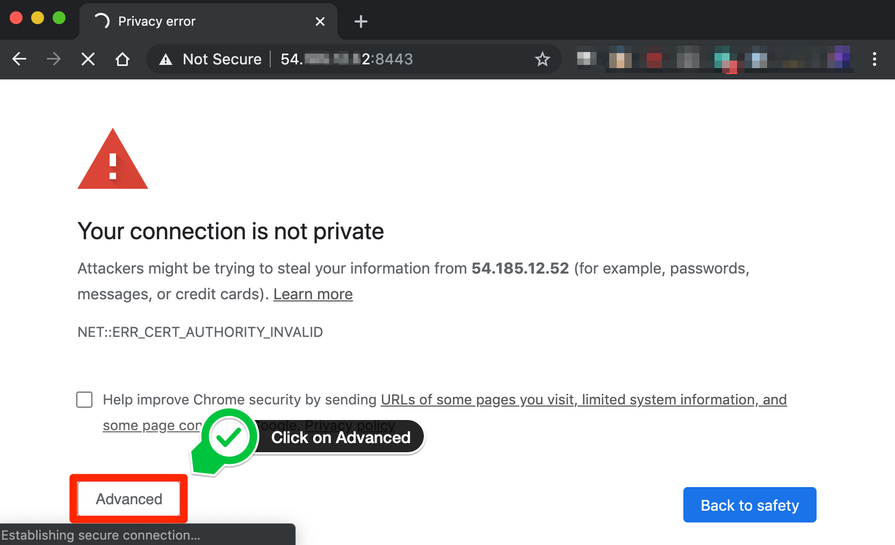
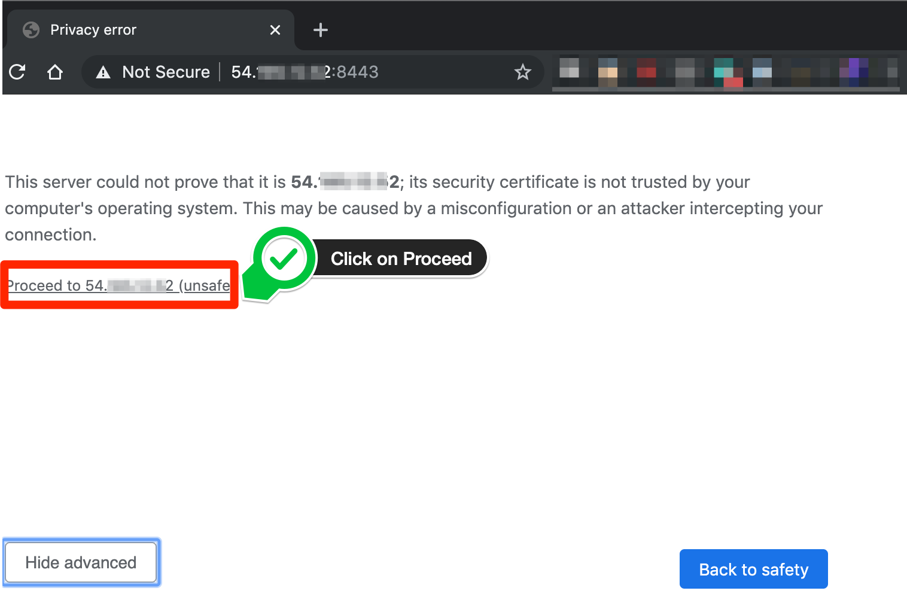
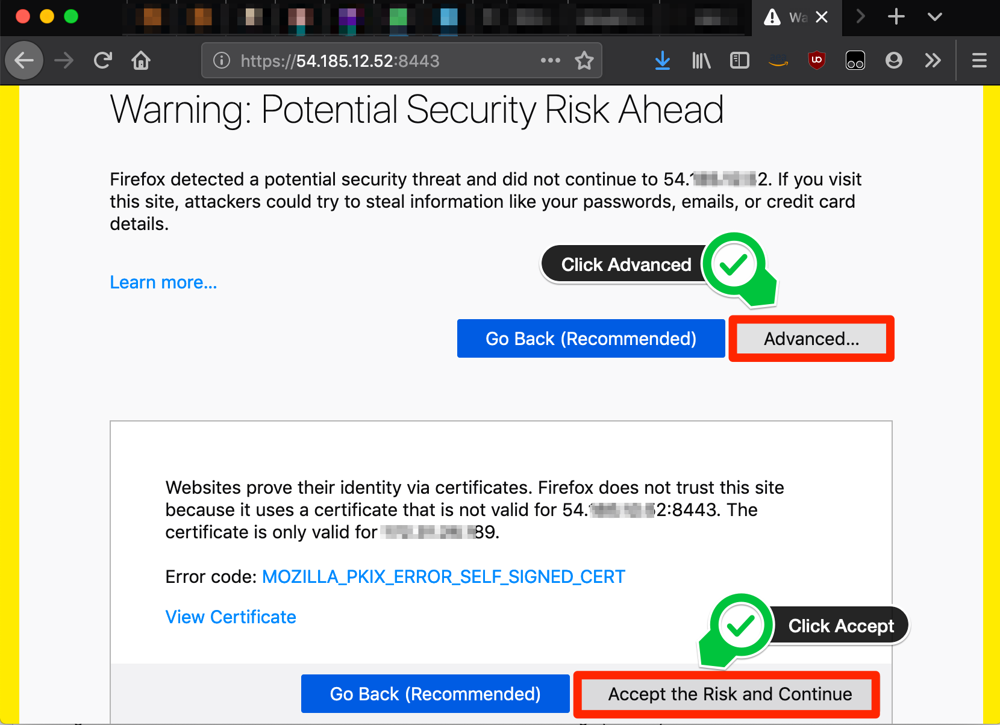
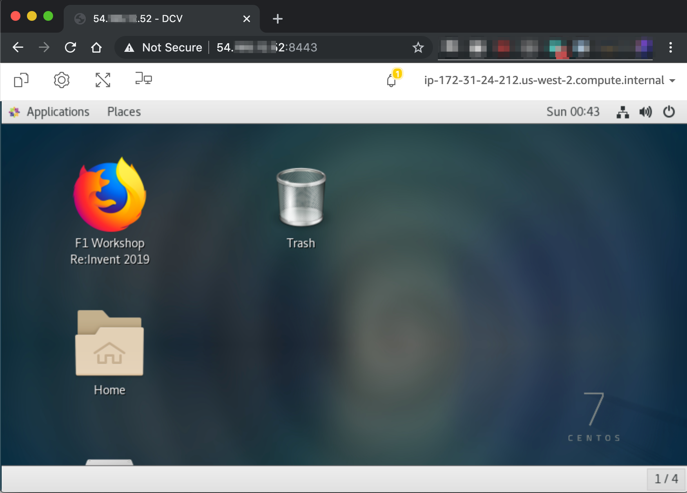
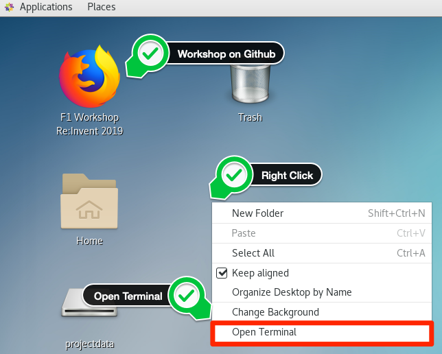

# Setup Instructions

For this workshop, an F1 instance is pre-setup for you and instance connection details should have been provided to you by the workshop support staff.

We will be using NICE DCV to start a remote desktop session to your instance.

> **NOTE:** We have seen VPN connections causing issues with connections. If you face such an issue, please re-try after turning your VPN connection off.

### Connect to your instance
To be able to connect to the instance, you have two options in order of preference:

1. **Using the NICE DCV Client(Preferred/Stable)**

   * Download and install the [DCV Client](https://download.nice-dcv.com/) for your laptop platform.
   
   * Use the Public IP address, and port 8443 to connect.

      An example login screen (for the DCV Client you will need to connect first using the IP:Port, for example `111.222.333.444:8443`):

      
   * Login using the username `centos` and the password provided to you.
   * You should now be able to see your Desktop running on an F1 Instance
      
   
1. **Using a web browser**

   * You can use this option if you cannot download/use the DCV Viewer.
   * Make sure that you are using a [supported web browser](https://docs.aws.amazon.com/dcv/latest/adminguide/what-is-dcv.html#what-is-dcv-requirements).
   
   * Use the secure URL, Public IP address, and port 8443 to connect. For example: `https://111.222.333.444:8443`

      > **NOTE:** When you connect make sure to use the `https` protocol.
      
   * The DCV Server uses a self signed certificate. Since your browser does not have a way of verifying the certificate, you will see warnings on your browser about an untrusted/unsecure connection.
   * This is normal and you can bypass the warnings based on your browser
   
        * Chrome
            1. Click on Advanced
            
    
            1. Click on Proceed
            
   
        * Firefox
            1. Click on Advanced and then click on `Accept use risk and continue`
            

   * You should now be able to see your Desktop running on an F1 Instance
        

### Start your workshop
   

   * Once you are on your desktop, you should be able to open the workshop link and follow the same instructions.
   * Open a terminal and follow the [Workshop Module instructions](../README.md)
---------------------------------------

<b>
<a href="../README.md">Start the SDAccel Workshop!</a>
</b>

